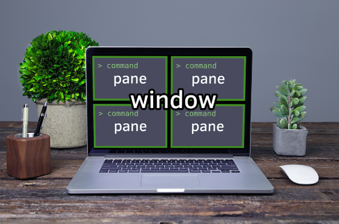

# tmux

Terminal Multiplexer



## Install

```
brew install tmux
```

- `tmux` หรือ `tmux new -s <session_name>` สร้าง session ใหม่
- `tmux attach-session -t <session_name>` จะ attach session
- `tmux a` จะ attach เข้า session ก่อนหน้า
- `tmux kill-session -t <session_name>` จะ delete session
- `tmux ls` ดูว่ามี session อะไรบ้าง

## Command

- ctrl-b d ให้ tmux detach session
- ctrl-b c สร้าง window ใหม่
- ctrl-b : เข้าสู่ prompt รอคำสั่ง
- ctrl-b :rename-window <window_name> ตั้งชื่อ window
- ctrl-b w ดูรายการ windows
- ctrl-b & ลบ windows ที่อยู่ปัจจุบัน
- ctrl-b | แยก pane ไปทางขวา
- ctrl-b - แยก pane ไปข้างล่าง
- ctrl-b ลูกศร ซ้ายขวาบนล่าง เลือก pane ไปตามทิศทางลูกศร
- ctrl-b t แสดงเวลา
- ctrl-b x toggle synchronize-panes พิมพ์ทีเดียวได้ทุก panes
- ctrl-b :kill-server ออกจาก session และปิด tmux server

see [tmux-cheatsheet](./tmux-cheatsheet.md)

[](https://asciinema.org/a/246048)

## Config

`~/.tmux.conf`

```
# Pane Splitting
unbind %
unbind '"'
bind | split-window -h
bind - split-window -v

# Toggle sending keystrokes to all panes in a window
bind x setw synchronize-panes

# Make mouse useful in copy mode
set -g mouse on
```

## Reference:
 - https://github.com/tmux-plugins
 - [The Tao of tmux](https://leanpub.com/the-tao-of-tmux/read)
 - [Tmux — For Ninjas](https://hackernoon.com/https-medium-com-aamralkar-tmux-for-ninjas-5c38a1a51dc2)
 - [Linux Command Line Tutorial - Terminal Multiplexer (tmux)](https://code.snipcademy.com/tutorials/linux-command-line/tmux)
